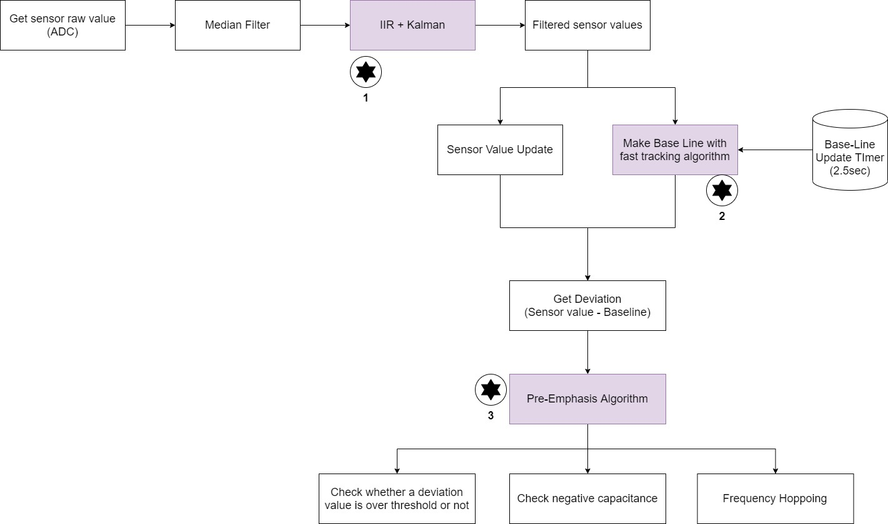
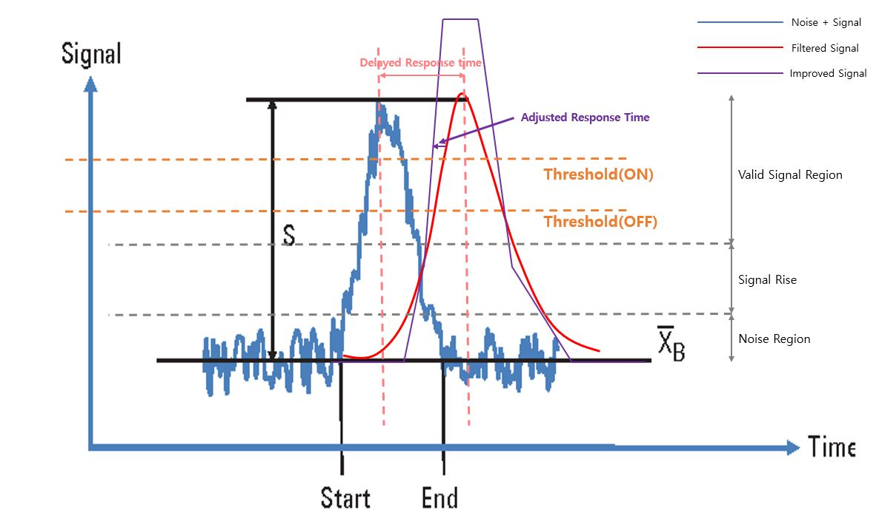
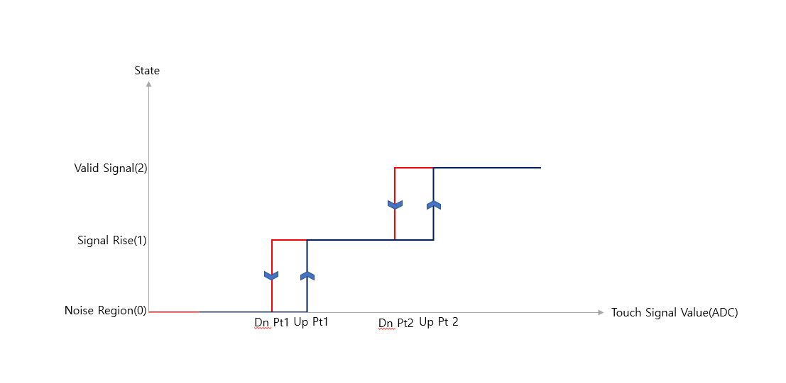
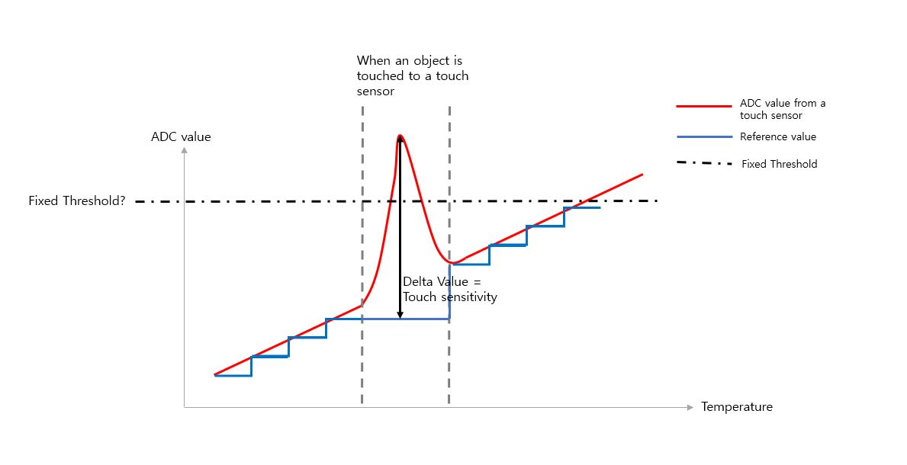
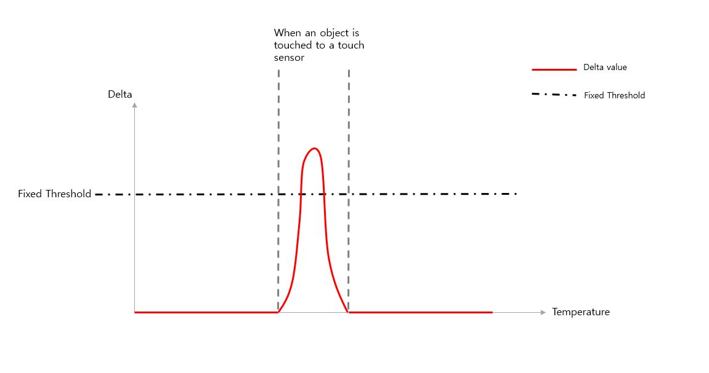
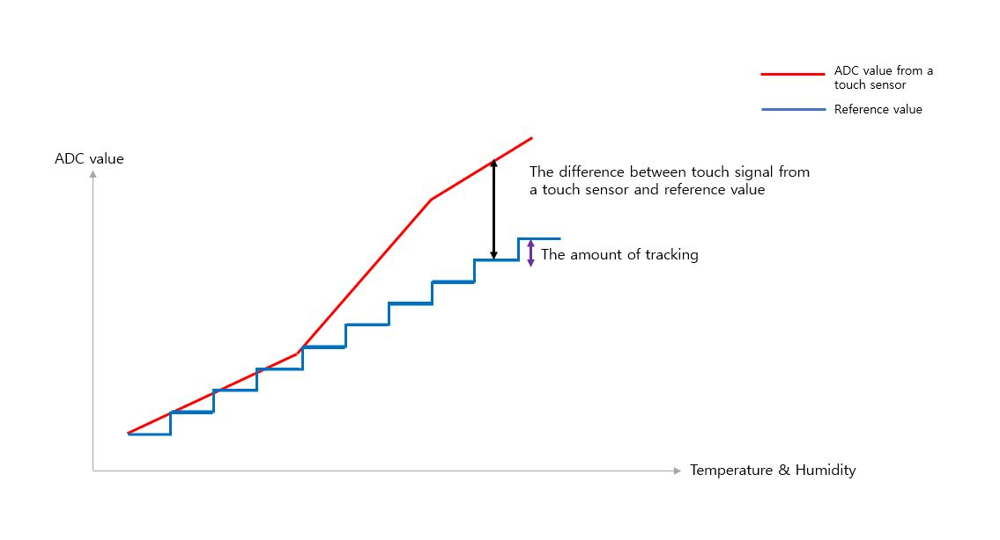
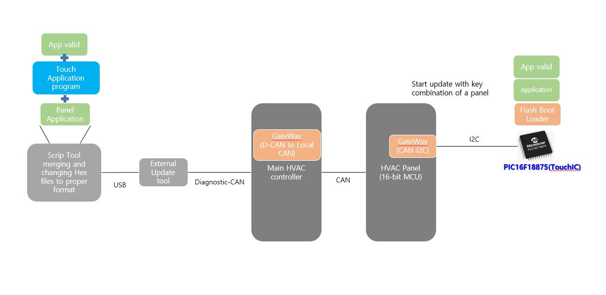
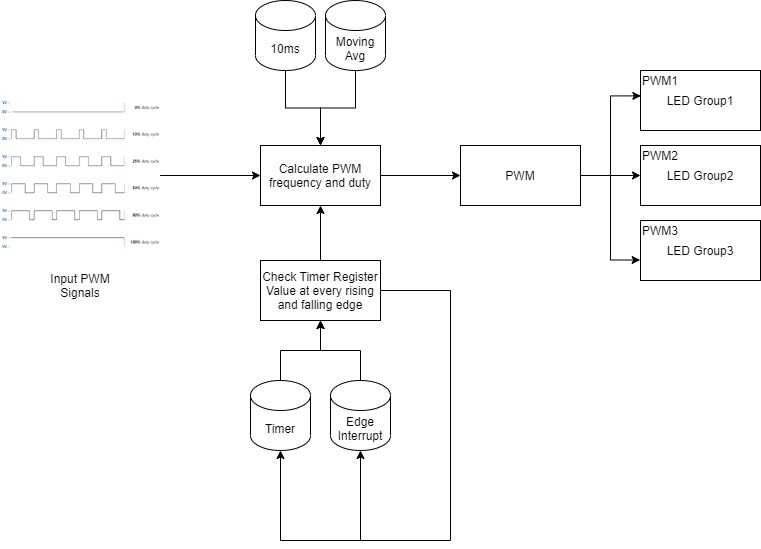
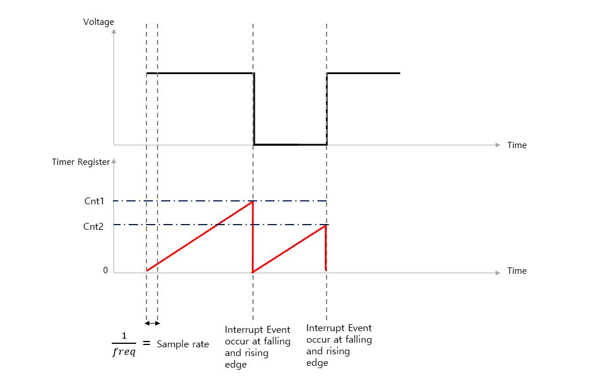

# The K9 (RJ)

## 1. Project Overview
- This project has 2 parts: Panel controller and proximity function
- I was in charge of the entire software development of the proximity touch system, applications and the HVAC controller panel 

## 2. Development Environment
-  Software Platform developed internally(Adpated OS platform)
-  Compiler: IAR
-  mPD78F1845 16-bit Microprocessor | PIC16F18875 8-bit Microprocessor
-  Git, Jira, Script Tool

## 3. Challenging issues / Approach and Solution / Result
This section demonstrates what were challenging issues, how to research them, and how to solve them

### Challenge #1 - Improving the performance of the touch system by devising software algorithms
When implementing a proximity function with a touch system, there were a lot of challenging issues. The technical design was fully changed from an infrared based tech to a touch based tech. In addition, Since the PCB had limited physical space, it was difficult for our hardware team to alleviate the noise of touch signals by modifying the PCB layout. To solve this issue, I introduced new software algorithms, carefully addressing side effects, such as delayed response time, low touch sensitivity, functional problem in humid environments, and the limited ROM size of the 8-bit microprocessor.

### Approach and Solution #1
**(Step 1)** Implemented a combination of the filter algorithms (Kalman, Median), and integrated the combination into the software platform processing ADC to reduce the intensity of the noise<br>
**(Step 2)** Divided the min-max range of filtered ADC signals into the three domains (Noise, Signal Rise, Signal Detection) and allocated three constants (Gain factors) to each domain in order to compensate for the delayed response time of the filtered signals<br>
**(Step 3)** Memorized each gain factor in EEPROM (Electrically Erasable Programmable Read-Only Memory)<br>
**(Step 4)** Tuned these gain factors by using the external tool and diagnostic-CAN (Controller Area Network) in order to finalize ideal gain factors improving side effects<br>
**(Step 5**) Devised the new algorithm that tracks the reference values (filtered ADC) at regular time interval and integrated it into the software module processing touch sensitivity, enhancing functional safety of the touch system<br>
**(Step 6)** Optimized the added software code to meet the limited ROM size<br>

<p align="center">
<br>
<strong>Fig.1) the entire block diagram of the combination algorithm</strong>
<p>

**Fig.1)** shows the entire block diagram of the touch signal processing. The three purple-colored blocks with star shape are added to improve the performance of the proximity touch system (noise, response time, sensitivity). The performance of the touch based proximity system was degraded, because the PCB was intolerant to noisy environment caused by signals with various frequencies and the proximity touch sensor was very small (Width: 57.4mm / Front Height: 3mm / Upper Height: 3.5mm). This tiny sensor had to recognize the 3D space (Width: 250mm, Height: 50mm, Depth: 10mm). Since our OEM did not approve changing our product's design to increase the physical area of a touch sensor, we had to overcome these limitations with software algorithms.

<p align="center">
<br>
<strong>Fig.2) Touch signal(ADC) behavior according to algorithms</strong>
<p>

**Fig.2)** shows how the touch signal(ADC) changes after applying filter and PreEmphasis algorithm. If the amount of fluctuation of a noise exceeds the range (Threshold On ~ Threhosld Off), the touch system is going to bring about malfunction. In order to reduce the noise fluctuation, I implemented the combination of IIR and Kalman filter.
```c
//Calculation
//New = ((N-1)*Old + New)/N

//Global Variables storing old and result value
uint32_t u32Old = 0;
uint32+t u32Rest = 0;_

void IIR_FILTER(Xtype* prox)
{
    uint32_t u32CalTemp;
    u32CalTemp = u32Old * DENOMINATOR; //DENOMINATOR=8 (changable)
    u32CalTemp -= u32Old;
    u32CalTemp += u32Rest;
    u32CalTemp += (uint32_t)Xtype->PresentADCValue;
    
    u32FilteredVal = u32CalTemp / DENOMINATOR;
    u32Rest = u32CalTemp % DENOMINATOR;
    Xtype->PresentADCValue = u32FilteredVal;
    u32Old = u32FilteredVal;
}
```
u32Rest indicates the remainter after division. The remainter will be added in the next loop. The source code of Kalman FIlter for ADC can be found here: https://github.com/BravoHoseok/The-K9/blob/master/src/LOGIC_Kalman.c

In these filter algorithms, we can increase and decreases the intensity of the combined filter by changing the **DENOMINATOR** value in IIR and **LOGIC__nenKALMAN_R_CONST**, **LOGIC__nenKALMAN_Q_CONST**, **LOGIC__nenKALMAN_I_CONST** in Kalman Filter. When applying this combination filter algorithm, the noise of the original ADC signal will be alleviated. However, the delayed response time caused by the filtered touch signal (ADC) will become intensified. The a user iwill feel that the sensitivity and response of this touch system is poor. This is the side effect of filter algorithms. But this problem can be solved by applying 'PreEmphasis' algorithm.

To implement 'PreEmphasis' algorithm, we first need to define 3 domain (Noise Region, Signal Rise, Valide Signal) by monitoring the fluctuation of the touch signal. And then, set a hysterisys range of three region as shown in **Fig.3**. 

<p align="center">
<br>
<strong>Fig.2) Hysterisys Table</strong>
<p>

By putting the touch sensitivity value on the X-axis and utilizing the interpolation algorithm, we can find a state (0 or 1 or 2) of the current touch signal on the three regions. Now, let's assign 'Gain factors' to each region as shown pseudocode below.
```c
>if(state == 0)//Noise State
{
    G_factor=Const_X;
}
else if(state == 1)//Signal Rise State
{
    G_factor=Const_Y;
}
else//Valid Signal State
{
    G_factor=Const_Z;
}
```

'Const_X', 'Const_Y', 'Const_Z' are constant in C programming. You can define these values by monitoring the signal patterns. However, I recommend defining these constant values based on the size of the sensitivity value. For example, if the sensitivity value is stored in int_16 variable, 
```sh
$ Const_X = (inputed sensitivity value) / 32767;
$ Const_Y = {[(inputed sensitivity value) / 32767] * [(inputed sensitivity value) / 32767)]} + 1;
$ Const_Z = (inputed sensitivity value) / 32767 + 1;
``` 

You can also customize the amount of sloops of the purple line in **fig.1)**  by adjusting these gain factors to a specific values. Also, the sensitivity will increase because of the gain foctors. I recommend tunning these values by storing them in EEPROM of a microprocessor, performing functional safety test in a laboratory with temperature chamber and electrical equipments.

<p align="center">
<br>
<strong>Fig.3) ADC value and Reference Value 1</strong>
<p>

<p align="center">
<br>
<strong>Fig.4) Delta Value</strong>
<p>

Fianlly, the last stage of this combination algorithm is implementing an 'algoritm tracking the ADC value of a touch sensor rapidly'. In the world of analog signal, the ADC value will change incessantly according to temperature range. It is the property of a microprocessor. As shown Fig.3), if we set a fixed threshold (black line) about the chaning ADC value in order to confirm whether an object is touched or not, it is going to make malfunctions in high temperature. To prevent this situation, we set reference value that tracks the ADC value periodically(1 or 2 sec or etc..) during no touch state. Here, a 'delta value' is defined as (ADC value) - (Reference value). By defining a delta value like this, we can check the sensitivity of the touch sensor regardless of the fluctuated temperature as shown **Fig.4)**. We call the sensitivity of a touch sensor the delta value.

<p align="center">
<br>
<strong>Fig.5) ADC value and Reference Value 2</strong>
<p>

**Fig.5)** shows the variance of the ADC value of a touch sensor according to temperature and humidity. We assume that the variance of the ADC value is getting more and more big according to temperature range, and the reference value tracks the ADC value in a fixed value (2 value / 1 sec). And then, the difference between the ADC value and the reference value is going to be getting bigger, ultimately surpass a threshold value and causing malfunctions such as erroneously recognized object touch. Thus, whether how properly the reference value tracks the ADC value or not determines the performance of a touch system. To implement this tracking algorithm, I used the IIR_FILTER algorithm above mentioned, and designed an algorithm that changes DENOMINATOR constant value (the amount of tracking) according to sloop rate of the ADC value during no touch state. This fast tracking algorithm provides more reliable functional safety of the touch system.

### Result #1
Improved the noise-immunity, the response time, and the sensitivity by 200%, by 40%, and by 30% respectively

---

### Challenge #2 - Inventing software update system for a secondary microprocessor in a complete car
As two microprocessors (16-bit and 8-bit) are applied in our product, we decided to provide the software update function of the secondary microprocessor in complete car in order to perform projects efficiently in terms on time and costs.

### Approach and Solution #2
**(Step 1)** Designed the concept of a software update system from an external tool to the target microprocessor<br>
**(Step 2)** Created FBL (Flash Boot Loader) of the target microprocessor
**(Step 3)** Implemented the gateway module (CAN-I2C) to transfer binary data from the main microprocessor to the target microprocessor<br>
**(Step 4)** Designed memory field used in Script tool, such as Flash Boot Loader, Application, Validation Check, Variation<br>
**(Step 5)** Invented Script tools that convert different types of Hex files (Intel, Motorola) to a suitable format and merge them<br>
**(Step 6)** Developed the external update tool that sends the update file through diagnostic-CAN<br>

<p align="center">
<br>
<strong>Fig.6) the block diagram of the update system</strong>
<p>

**Fig.6)** shows the entire block diagram of the update system applied in this project. Due to the short period of this project, I have to implement the update system quickly. Thus, my solution was merging a touch application code to an update file of a panel program, since delivering only touch application binary data to the target microprocessor required a lot of development time.

I merged the touch application program into the unused ROM area of the main microprocessor of the panel. Fortunately, since the panel program occupied small Rom area, I could allocate the unused Rom area for the touch application program. I consolidated two Hex files (Panel Application program, Touch Application program) to one Hex file by developing a script tool that converts two hex files to one proper update format. After updating the panel program, the update of the touch program will start by pushing a specific key combination on the panel. As soon as beginning the update sequence, the gateway module will read the touch program stored in ROM and transfer the binary data to the target microprocessor through I2C.

### Result #2
Saved the time and costs spent on the software update from 15 min per one product to 1 min per oneproduct, from $22 per one product to $1.5 per one product respectively

---

### Challenge #3 - Implementing a software dimming control
To control illumination LEDs independently and reduce the cost of our product, we applied software dimming control to our product instead of illumination controlled by electrical wires. When implementing this function, the tolerance of analog signals is very important, for unstable frequency signals bring about malfunction for recognizing the frequency of duty of the analog signals. I utilized 'Timer' and 'PWM' function already embedded in the microprocessor in order to develop software dimming control function.

### Approach and Solution #3
**(Step 1)** Designed the concept of the software dimming algorithm<br>
**(Step 2)** Devised functions that calculates the frequency and duty value of PWM signals<br>
**(Step 3)** Implemented software dimming algorithm that increases and decreases the illumination brightness of the LEDs linearly based on the calculated duty and frequency, when detecting the proximity of an object<br>
**(Step 4)** Programmed all these functions<br>

<p align="center">
<br>
<strong>Fig.7) the entire block diagram of software dimming control</strong>
<p>

**Fig.7) ** shows the entire block diagram of the software dimming control algorithm. This function have to ensure that there are no blinking errors of output PWM signals, while the duty of input PWM signals change.

<p align="center">
<br>
<strong>Fig.8) input PWM signal and Timer register value</strong>
<p>

**Fig.8)** shows how to calculate the frequency and duty value of a PWM signal by employing Timer and Interrupt. The interrupt signal will be made every rising and falling event, while the timer register value accumulates. Below simple pseudocode describes the method of gauging the frequency and duty values.

> Positive_CNT = CNT1 @ falling edge interrupt event<br>
Negative_CNT = CNT2 @ rising edeg interrupt event<br>
Period_CNT = Positive_CNT + Negative_CNT<br>
Signal_Freq = Sample Rate(Frequency) / Period_CNT = 1/(Period_CNT * Sample rate(sec))<br>
Signal_Duty = (Positive_CNT / Period_CNT) * 100<br>
Check whether the input PWM signal is high state(short) or zeor state(open)<br>
if(PWM signal ==high state) output PWM signal duty = 100%<br>
elseif(PWM signal ==Low stat) output PWM signal duty = 0%<br>
Check the frequency error of input PWM signals<br>
if(the frequency of input PWM signals == error) output PWM signal duty = 0%<br>

### Research and Solution #3
Built know-how in developing software dimming control function.
___
